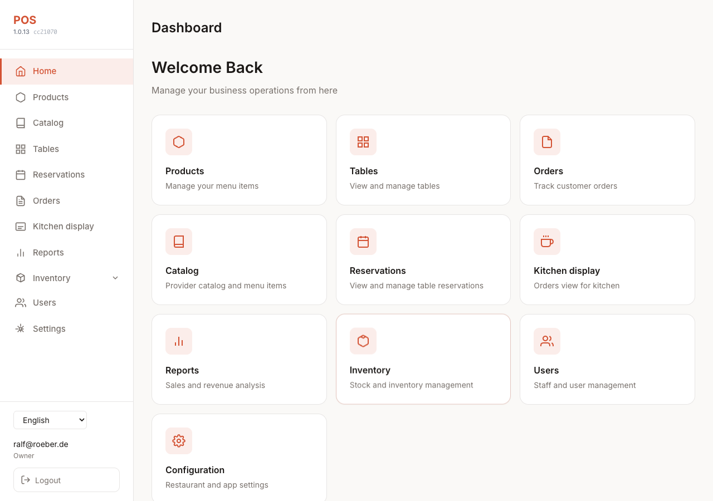
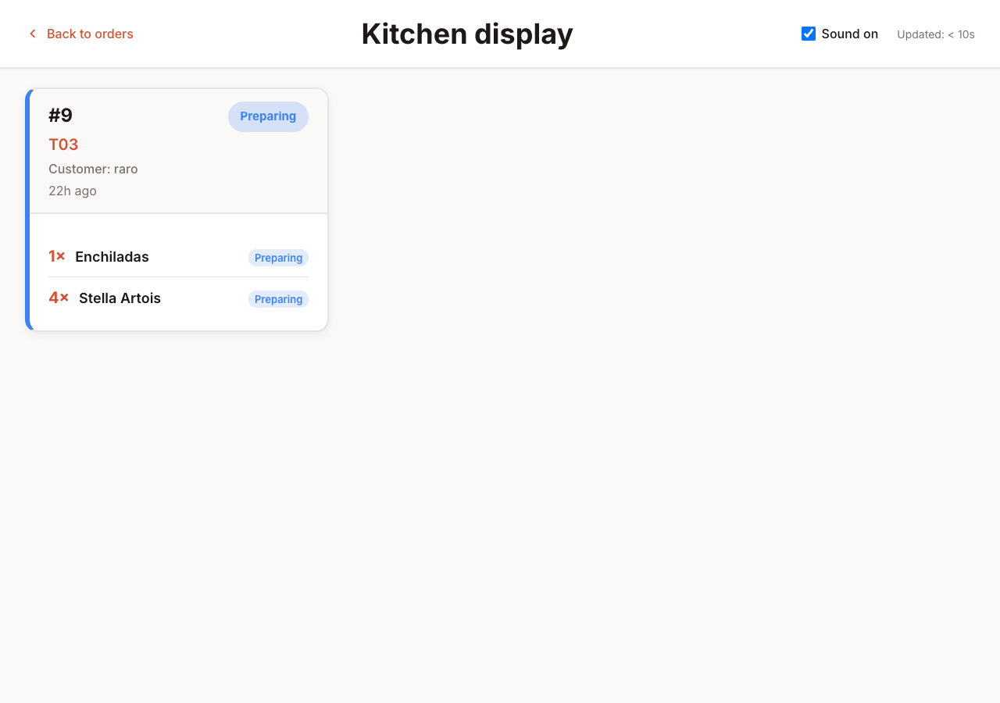
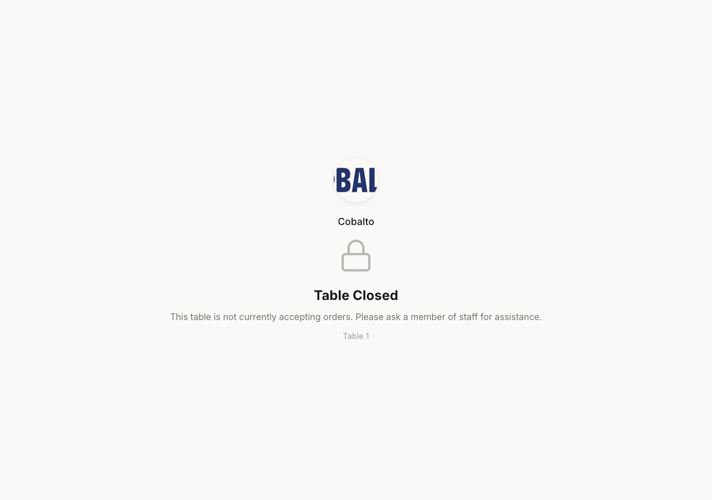

<div align="center">


[](https://github.com/satisfecho/pos/releases)
[](https://github.com/satisfecho/pos/actions)
[](LICENSE)
[](https://github.com/satisfecho/pos/commits)
[](https://github.com/satisfecho/pos/stargazers)

[](docker-compose.yml)
[](front/)
[](back/)
[](docker-compose.yml)

**Restaurant POS and ordering infrastructure — self-hosted, multi-tenant, real-time.**

_A point-of-sale system with a customer-facing menu, table management, and reservations. Staff use the Angular admin. Guests order via QR codes. You keep full control of your data and deployment._

**Topics:** `restaurant-pos` · `multi-tenant` · `self-hosted` · `docker` · `fastapi` · `angular` · `postgresql` · `stripe` · `kitchen-display`

**[Try the live demo →](https://satisfecho.de/)**

---
</div>


## About the Project

POS2 is built for restaurants and venues that want:

- **One place for operations** — Orders, tables, reservations, and the menu in a single stack.
- **Customer ordering without apps** — Guests scan a table QR code and browse the menu. An optional table PIN limits who can order.
- **Real-time updates** — Order status (pending → preparing → ready → delivered → paid) reaches staff and guests over WebSockets.
- **Multi-tenant from day one** — Each restaurant (tenant) has isolated data, settings, and its own payment setup.
- **Self-hosted** — Run on your own server or local network. There is no vendor lock-in.

---

## Start with one feature

You do not need the full POS on day one. Start with **one public feature** and add the rest when you are ready. Other areas stay in the same tenant. Turn them on in **Settings → Navigation** when you need them.

### QR menu only (free to start)

The **digital QR menu** is part of every plan. On **self-host (AGPLv3)** there is **no license fee**. On hosted Satisfecho you get a **free trial** with no card required. Live prices are on the Public pricing row below.

1. **Register** your restaurant ([Getting Started](#getting-started) below).
2. Add items under **Products** in the staff app.
3. Create tables under **Tables** and open each table’s **QR code** (print or display it).
4. Guests scan the code and browse **`/menu/{table_token}`**. They do not install an app.

Add later when you want: table PIN, online checkout, kitchen display, and inventory. URLs are in [Access Points](#access-points).

### Reservations only

Use **online booking** without the full order flow.

1. **Register** and sign in (see [Getting Started](#getting-started)).
2. Turn on **Reservations & guest feedback** under **Settings → Navigation** if it is not already enabled.
3. Share **`/book/{tenantId}`**.
4. Staff manage bookings at **`/reservations`**.

Guests can join the **waiting list** at **`/waitlist/{tenantId}`** (linked from the book page). Staff and guest flows: the Reservations row below.

### Screenshots

Staff dashboard, kitchen display, and customer menu — a quick visual sense of the product.

<p float="left">
  
  
  
</p>

*More screenshots (orders, reports, reservations, tables, provider portal) are listed in [docs/screenshots/README.md](docs/screenshots/README.md).*

---

## Features

| Area | What's included |
|------|------------------|
| **Orders** | Full lifecycle (pending → preparing → ready → delivered → paid). Session-based orders per browser. Item-level status; partial delivery; order modification and cancellation before delivery; soft delete with “Show removed items” in staff UI. Session rules and status reset: [docs/0008-order-management-logic.md](docs/0008-order-management-logic.md). **Print invoice** and **Print Factura** (with optional billing customer and tax breakdown) open the browser print dialog. See [docs/0017-billing-customers-factura.md](docs/0017-billing-customers-factura.md). |
| **Tax (IVA)** | Tax-inclusive pricing with per-tenant tax rates (name, rate %, validity). Default tax in Settings; product-level tax override. Order items store applied tax snapshot for invoice breakdown. |
| **Billing customers (Factura)** | Register customers that need a tax invoice with company details (name, company, CIF/tax ID, address, email, phone). List and search at `/customers`; from Orders, **Print Factura** lets you select a customer and print an invoice with “Bill to” block; optionally save the customer on the order. End-user accounts and MFA are not shipped ([docs/0002-customer-features-plan.md](docs/0002-customer-features-plan.md)). |
| **Customer menu** | Browse menu, cart, place order, order history. |
| **Kitchen display** | Dedicated full-screen view at `/kitchen`: large order cards, auto-refresh and WebSocket updates, optional sound on new orders. Read-only; same access as Orders. See [docs/0015-kitchen-display.md](docs/0015-kitchen-display.md). |
| **Reports** | Sales & revenue at `/reports` (owner/admin): date range, summary (total revenue, order count, average payment per client), reservation count and by source (public/staff), by product/category/table/waiter, charts, CSV/Excel export. See [docs/0016-reports.md](docs/0016-reports.md). |
| **Payments** | **Stripe** and **Revolut** (online checkout on the customer menu; per-tenant configuration in **Settings**). **Cash** and **card terminal (dataphone)** when staff marks the order paid. Optional **immediate payment required** (checkout opens right after placing order). Revolut sandbox and redirect URLs: [docs/REVOLUT.md](docs/REVOLUT.md). |
| **Tables** | Table management, QR codes, canvas view. Table activation and 4-digit PIN so only present guests can order; PIN rate limiting via Redis. See [docs/0009-table-pin-security.md](docs/0009-table-pin-security.md). |
| **Staff navigation** | After sign-in, the sidebar matches operational areas: **Dashboard**, **My shift** (optional), **Orders**, **Reservations** and **Guest feedback** (when the reservations module is enabled), **Tables** (list and canvas), **Kitchen** and **Bar** displays, **Customers**, **Products**, **Catalog** (when the providers module is enabled), **Reports**, **Working plan**, **Inventory** (items, suppliers, purchase orders, stock, reports — admin), **Users**, **Contracts** (when permitted), **Settings** (admin). |
| **Reservations** | Staff: list, create, edit, seat, finish, cancel at `/reservations`. **Client notes** (from the customer at booking) and **owner notes** (internal staff notes). **Client technical info** (IP, user-agent, browser fingerprint, screen size) is recorded for public bookings and visible to staff. **No-show**: mark no-shows and **send reminders** by email and/or **WhatsApp** (when Twilio is configured). Public: book at `/book/:tenantId`, view/cancel at `/reservation?token=...`. **Waiting list:** public join at `/waitlist/:tenantId` (linked from the book page); staff manage the queue on the Reservations waiting-list tab. Table status: available / reserved / occupied. See [docs/0011-table-reservation-user-guide.md](docs/0011-table-reservation-user-guide.md). |
| **Real-time** | WebSocket updates for order status; token-based WS auth (`/ws-token`). |
| **i18n & currency** | Languages: English, Spanish, Catalan, German, French, Bulgarian, Chinese (Simplified), Hindi, Urdu (RTL). Files: `front/public/i18n/*.json`. Language picker in the admin sidebar and on the public menu. API: `?lang=es` (or another code) for localized messages. Per-tenant currency (EUR, USD, MXN, INR, CNY, TWD, and others). See [docs/0012-translation-implementation.md](docs/0012-translation-implementation.md). |
| **Multi-tenant** | Isolated data per tenant; first user becomes owner; configurable roles (owner, admin, kitchen, bartender, waiter, receptionist, courier) and permissions (e.g. reservation read/write). |
| **Restaurant groups** | Multi-location operators can **create**, **join**, or **leave** a restaurant group (Settings → Restaurant group) and optionally **share billing customers** and/or **product catalog** across sibling locations. See [docs/0054-restaurant-groups.md](docs/0054-restaurant-groups.md). |
| **Satisfecho Delivery** | First-party delivery channel (not Glovo/Uber): staff **Delivery** tab on Orders, create/assign courier, public guest checkout at `/delivery/{tenantId}`. See [docs/0053-satisfecho-delivery-order-channel.md](docs/0053-satisfecho-delivery-order-channel.md). |
| **Courier portal** | Couriers log in at `/courier/login` and work Mine / order actions at `/courier`. Demo credentials: `COURIER_EMAIL` / `COURIER_PASSWORD` in `config.env.example`. |
| **SaaS signup paywall** | After guided signup (`/register` / `/signup`), new tenants may hit `/paywall` (trial or subscribe) when the paywall flag is on. See [docs/0052-saas-signup-paywall.md](docs/0052-saas-signup-paywall.md). |
| **Public pricing** | Hosted trial/monthly price from live `GET /saas/config` at **`/pricing`** (no login). Self-host / AGPLv3 alternative; does not imply billing when paywall is off. |
| **Platform operator** | Satisfecho platform admins log in at `/platform/login` and oversee tenants at `/platform`. Distinct from provider and tenant staff. See [docs/0059-platform-operator-portal.md](docs/0059-platform-operator-portal.md). |
| **Products & images** | Staff manage products at `/products`. On deploy, demo products are linked to catalog provider products so the Products page shows images (beer/pizza/wine import); first load of `/products` backfills image URLs. |
| **Provider portal** | Suppliers register at `/provider/register`, log in at `/provider/login`, and manage their catalog at `/provider` (tile/list view, search, add/edit/delete products, company details). See [docs/0014-provider-portal.md](docs/0014-provider-portal.md). |
| **Tenant branding (public)** | Per-tenant **background colour**, **primary button colour** (blue OOBE default when unset), and **header background image** for book, menu, waitlist, delivery, feedback, and reservation-view pages. Set in Settings → Business profile; optional dark overlay when a header image is used. See [docs/0028-tenant-public-branding.md](docs/0028-tenant-public-branding.md). |
| **Public features (marketing)** | Product capabilities for prospects at **`/features`** (no login). Linked from the landing nav (“View all features”); uses the same landing site footer as the home page. |
| **Public about** | Company / About us at **`/about`** (no login). Names **Amvara Consulting S.L.**; linked from marketing nav and footer Support. |

Planned, not yet implemented: Order Phase 4 (batch operations, audit, item replacement) and a stricter “must pay before continuing” flow. Further security items (for example CAPTCHA after failed logins) are in [ROADMAP.md](ROADMAP.md).

---

## Built With

- **Frontend:** Angular 21+ (SPA)
- **Backend:** FastAPI, SQLModel ORM
- **Database:** PostgreSQL 18
- **Cache / pub-sub:** Redis 7
- **Real-time:** WebSocket bridge (custom service)
- **Deployment:** Docker Compose, HAProxy

---

## Getting Started

### Prerequisites

- [Docker](https://docs.docker.com/get-docker/) and [Docker Compose](https://docs.docker.com/compose/install/)
- Git

### Quick Start

1. **Clone the repository**
   ```bash
   git clone https://github.com/satisfecho/pos
   cd pos
   ```

2. **Configure environment**
   ```bash
   cp config.env.example config.env
   ```
   Local defaults are enough to start. For production or a custom domain, set `API_URL`, `WS_URL`, `CORS_ORIGINS`, and `SECRET_KEY`. Use `https://` and `wss://` in production. See [docs/0004-deployment.md](docs/0004-deployment.md). Variable meanings are in [Configuration](#configuration).

3. **Start all services**
   - **Local (development):** `docker compose -f docker-compose.yml -f docker-compose.dev.yml --env-file config.env up -d`
   - **Production (e.g. amvara9):** `docker compose -f docker-compose.yml -f docker-compose.prod.yml --env-file config.env up -d`

4. **Find the app URL**
   Run `docker compose -f docker-compose.yml -f docker-compose.dev.yml ps` (or with `.prod.yml` if you used prod). Read the **PORTS** column for `haproxy` (for example `0.0.0.0:4202->4202/tcp`). The host port is the app URL. The route list is [Access Points](#access-points). If the port is not 4202, use that port in those URLs.

5. **Create an account**
   There is no pre-seeded user. Open **`/register`** on that host. Enter tenant name, email, and password. The first user becomes the tenant owner. Then sign in at the app URL.

---

## Access Points

| Purpose | URL |
|--------|-----|
| **Unified app (frontend + API via HAProxy)** | http://localhost:4202 |
| **API docs (Swagger)** | http://localhost:4202/api/docs |
| **Health check** | http://localhost:4202/api/health |
| **DB health** | http://localhost:4202/api/health/db |
| **Public menu (example)** | http://localhost:4202/menu/{table_token} |
| **Public booking** | http://localhost:4202/book/{tenantId} |
| **Public waiting list** | http://localhost:4202/waitlist/{tenantId} |
| **Public features (marketing)** | http://localhost:4202/features |
| **Public pricing** | http://localhost:4202/pricing |
| **Public about** | http://localhost:4202/about |
| **Public guest feedback** | http://localhost:4202/feedback/{tenantId} |
| **Public Satisfecho Delivery (example tenant 1)** | http://localhost:4202/delivery/1 |
| **Provider login** | http://localhost:4202/provider/login |
| **Provider dashboard** | http://localhost:4202/provider |
| **Courier login** | http://localhost:4202/courier/login |
| **Courier dashboard** | http://localhost:4202/courier |
| **SaaS paywall** | http://localhost:4202/paywall |
| **Platform operator login** | http://localhost:4202/platform/login |
| **Platform operator dashboard** | http://localhost:4202/platform |
| **Kitchen display** | http://localhost:4202/kitchen |
| **Bar display** | http://localhost:4202/bar (beverage-station view of the kitchen display) |
| **Reports (owner/admin)** | http://localhost:4202/reports |
| **Customers (Factura)** | http://localhost:4202/customers |
| **Dashboard (staff)** | http://localhost:4202/dashboard |

---

## Configuration

Key variables in `config.env` (see `config.env.example` for the full list):

| Variable | Description | Required |
|----------|-------------|----------|
| `SECRET_KEY` | JWT signing; change in production | Yes |
| `REFRESH_SECRET_KEY` | Refresh token signing; must differ from `SECRET_KEY` | Yes |
| `API_URL` | Backend base URL used by frontend (e.g. `http://localhost:4202/api`) | For custom domain |
| `WS_URL` | WebSocket URL (e.g. `ws://localhost:4202/ws`) | For custom domain |
| `CORS_ORIGINS` | Allowed frontend origins (comma-separated) | Yes (production) |
| `POSTGRES_*` / `DB_*` | Database connection | Yes |
| `STRIPE_CURRENCY` | Fallback currency if tenant has none | Optional |
| `SAAS_PAYWALL_ENABLED` | When `true`, new restaurant signups hit `/paywall` after guided signup. Default `false` for local/demo. | Optional (default `false`) |
| `TWILIO_ACCOUNT_SID`, `TWILIO_AUTH_TOKEN`, `TWILIO_WHATSAPP_FROM` | Optional; when set, reservation reminders can be sent via WhatsApp (in addition to email) | Optional |
| `DEFAULT_PHONE_COUNTRY` | ISO country code (e.g. `ES`, `DE`) for normalizing reservation phone numbers to E.164 | Optional (default `ES`) |

Settings also include business profile, contact (phone, email, address, **Tax ID**, **CIF**), and opening hours.

---

## Documentation

Each feature row links to its guide. The full index is [docs/README.md](docs/README.md). Release notes are in [CHANGELOG.md](CHANGELOG.md).

---

## Architecture

```
Browser → Frontend (Angular) → Backend (FastAPI) → PostgreSQL
                                    ↓
                               Redis (pub/sub)
                                    ↓
                          WebSocket bridge → Browser (real-time)
```

**Services (Docker Compose):**

- **haproxy** — Single entry point; routes `/` to frontend, `/api` to backend, `/ws` to WebSocket bridge. Port from `FRONTEND_PORT` (default 4202).
- **front** — Angular SPA (dev server in container).
- **back** — FastAPI app (Uvicorn).
- **ws-bridge** — WebSocket server; subscribes to Redis and pushes order updates.
- **db** — PostgreSQL 18.
- **redis** — Cache and pub/sub.

---

## Development

### Logs and port

- **Port:** `docker compose -f docker-compose.yml -f docker-compose.dev.yml ps` → PORTS for `haproxy` → use that host port in the browser.
- **Logs:** `docker compose -f docker-compose.yml -f docker-compose.dev.yml logs -f` (all); same `-f` list with `logs --tail=50 back`, `logs --tail=80 front`, `logs --tail=30 haproxy`.

See [AGENTS.md](AGENTS.md) for more detail.

### Backend tests

After `docker compose … up`, run the FastAPI **`TestClient`** suite in the **back** container (uses Postgres; rate limits disabled for tests):

```bash
docker compose -f docker-compose.yml -f docker-compose.dev.yml exec -T back python3 -m pytest /app/tests -q
```

The suite includes small guards such as **`tests/test_settings_defaults.py`** (e.g. **`EMAIL_FROM`** default). Puppeteer UI scripts and reservation capacity tests are in **[docs/testing.md](docs/testing.md)**.

### Landing footer version (Docker dev)

The `front` service bind-mounts **`./front` only**, so the container has **no `.git`**. **`front/docker-entrypoint.sh`** runs **`get-commit-hash.js`** on start to refresh **`commit-hash.ts`**. **`./run.sh`** exports **`COMMIT_HASH`** from the host repo (when unset) so the footer shows the current **short hash**. If you use **`docker compose`** directly, optionally run from the repo root: **`export COMMIT_HASH=$(git rev-parse --short HEAD)`** before **`up`** (see **`config.env.example`**).

### Database migrations

Migrations live in `back/migrations/` and run automatically on backend startup.

- **Apply manually:** `docker compose -f docker-compose.yml -f docker-compose.dev.yml exec back python -m app.migrate`
- **Check pending:** `docker compose -f docker-compose.yml -f docker-compose.dev.yml exec back python -m app.migrate --check`
- **New migration:** Use timestamped names, e.g. `back/migrations/YYYYMMDDHHMMSS_description.sql`. See `back/migrations/README.md`.

Do not edit existing migration files; add a new migration to change schema.

### PostgreSQL: connecting from your machine

The Compose database publishes **`127.0.0.1:${POSTGRES_PORT:-5433}`** → container port **5432** (see `config.env`). The **superuser name** is **`POSTGRES_USER`** (default **`pos`**), same as **`DB_USER`** for the app — **not** the conventional PostgreSQL role name **`postgres`**.

If **`docker logs pos-postgres`** shows **`FATAL: role "postgres" does not exist`**, a client (GUI, `psql`, or a copy-pasted DSN) is using username **`postgres`**. Point it at **`POSTGRES_USER`** / **`DB_USER`** and **`POSTGRES_PASSWORD`** / **`DB_PASSWORD`** from `config.env` instead.

**Ad-hoc SQL:** There is no relation **`restaurantorder`**. Orders live in **`"order"`** (quoted — SQL keyword), line items in **`orderitem`**, floor tables in **`"table"`**. See [docs/0033-postgres-adhoc-sql-table-names.md](docs/0033-postgres-adhoc-sql-table-names.md).

### Hot reload

- Frontend and backend both reload on code changes when run via Docker Compose.

### Stopping

```bash
docker compose -f docker-compose.yml -f docker-compose.dev.yml --env-file config.env down
```

---

## Security Notes

- **Production:** Set a strong `SECRET_KEY` and `REFRESH_SECRET_KEY` in `config.env`.
- **CORS:** Set `CORS_ORIGINS` to your real frontend origin(s); avoid `*` in production if possible.
- **Database:** Use strong credentials; do not commit `config.env`.
- **Stripe:** Use live keys in production. Set them per tenant in Settings.
- **Rate limiting:** Global and per-route limits (login, register, payments, public menu, uploads, admin/management) use Redis. See [docs/0020-rate-limiting-production.md](docs/0020-rate-limiting-production.md). Table PIN attempts stay rate-limited.

---

## Troubleshooting

| Issue | What to try |
|------|-------------|
| **Services won’t start** | Check port conflicts; ensure `config.env` exists and is valid; run `docker compose -f docker-compose.yml -f docker-compose.dev.yml logs`. |
| **Frontend can’t reach API** | Confirm `API_URL` and `WS_URL` match how the browser reaches the app (e.g. through HAProxy). Check CORS and browser console. |
| **Wrong port** | Use the host port from [Quick Start](#quick-start). |
| **DB connection errors** | Ensure `db` is healthy (`docker compose -f docker-compose.yml -f docker-compose.dev.yml ps`); with Compose, use `DB_HOST=db`. Check credentials in `config.env`. |

---

## License

Copyright (C) 2025 POS2 contributors.

This program is free software: you can redistribute it and/or modify it under
the terms of the GNU Affero General Public License as published by the Free
Software Foundation, either version 3 of the License, or (at your option) any
later version.

This program is distributed in the hope that it will be useful, but WITHOUT
ANY WARRANTY; without even the implied warranty of MERCHANTABILITY or
FITNESS FOR A PARTICULAR PURPOSE. See the GNU Affero General Public License
for more details.

You should have received a copy of the GNU Affero General Public License
along with this program. If not, see <https://www.gnu.org/licenses/>.

The full license text is in [`LICENSE`](LICENSE) (GNU Affero General Public License v3.0).

---

## Star History

[](https://star-history.com/#satisfecho/pos&Date)
