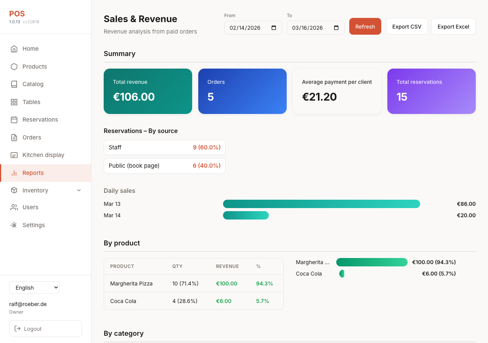

# Reports (Sales & Revenue)

Reports give restaurant owners and admins revenue analysis from paid orders: date range, summary, breakdown by product, category, table, and waiter, with simple charts and CSV/Excel export.



## Access

- **Route:** `/reports`
- **Permission:** `report:read` (owner and admin only)
- **Sidebar:** "Reports" link with chart icon (visible to owner/admin)

## Data source

- **Orders:** Only **paid** or **completed** orders in the selected date range.
- **Revenue date:** `paid_at` if set, otherwise `created_at`.
- **Items:** Excludes items that are removed by customer or cancelled.

## Features

| Feature | Description |
|--------|-------------|
| **Date range** | From / To (default: last 30 days). All report data is filtered by this range. |
| **Summary** | Total revenue (cents), total orders, **average payment per client** (revenue ÷ orders), reservation count, and daily series (date, revenue, order count). |
| **Reservations** | Total reservations in the date range (by `reservation_date`) and breakdown by source: **Public (book page)** (reservations with token) vs **Staff** (no token). Shown in summary card and "By source" block; Excel export includes a Reservations sheet. |
| **By product** | Product name, category (from Product), quantity sold, revenue. Table + bar chart. |
| **By category** | Category, quantity, revenue. Table + bar chart. |
| **By table** | Table name, revenue, order count. Table + bar chart. |
| **By waiter** | Waiter name (table’s assigned waiter or floor default), revenue, order count. Table + bar chart. |
| **Export CSV** | Downloads the summary daily data as CSV. |
| **Export Excel** | Downloads a workbook with sheets: Summary, Reservations, By Product, By Category, By Table, By Waiter. |

Charts are CSS-only (no extra JS libs). Currency comes from tenant settings (same as Orders).

## API

- **GET `/reports/sales?from_date=YYYY-MM-DD&to_date=YYYY-MM-DD`**  
  Returns combined report: `summary` (includes `average_revenue_per_order_cents`), `reservations` (total, by_source), `by_product`, `by_category`, `by_table`, `by_waiter`. Requires auth and `report:read`.

- **GET `/reports/export?from_date=...&to_date=...&format=csv|xlsx&report=summary|products|category|table|waiter`**  
  Returns file download. For `format=xlsx`, all report types are included in one workbook; `report` is ignored. For CSV, `report` selects which dataset to export.

## Testing

Puppeteer smoke test: login as owner or admin, open `/reports`, assert page and date range load.

```bash
cd front && BASE_URL=http://127.0.0.1:4202 HEADLESS=1 LOGIN_EMAIL=... LOGIN_PASSWORD=... npm run test:reports
```

See [testing.md](testing.md) for full test list.
