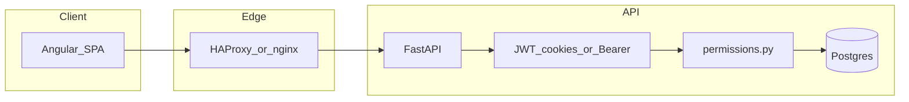

# Security review (POS2)

This document records a structured security pass aligned with the project security plan: uploads exposure, authentication, tenant isolation (IDOR), public and payment surfaces, injection/SSRF, operations, and dependencies. **It is not a penetration test**; repeat after major releases.

## Architecture (auth and tenant boundary)



- **Sessions:** Short-lived JWT in `HttpOnly` cookie `access_token`; refresh in `refresh_token` with separate `REFRESH_SECRET_KEY`. `PRODUCTION=true` sets `secure` cookies (`back/app/main.py`).
- **Revocation:** `User.token_version` must match JWT claim (`back/app/security.py`).
- **RBAC:** `require_permission` / `require_role` on mutating routes (`back/app/permissions.py`).

## 1. Uploads and static files (fixed)

### Finding (remediated)

The app mounted `StaticFiles` on `/uploads` over the entire `uploads/` tree. Staff contract PDFs are stored under `uploads/{tenant_id}/contracts/`. Explicit routes existed only for `logo`, `header`, `products`, and `providers/.../products`, so **`GET /uploads/{tenant_id}/contracts/{filename}` was served publicly** without authentication.

### Remediation

- Added **`GET /uploads/{tenant_id}/contracts/{filename}`** handler that always returns **403**, registered **before** the `StaticFiles` mount (`back/app/main.py`).
- **Regression test:** `back/tests/test_uploads_security.py`.

### Residual notes

- **`/uploads/providers/{token}/...`:** Non-`products` paths could still be served by `StaticFiles` if files were placed there. Provider `token` is a UUID (`models.Provider`). Prefer keeping only `products/` under each token directory.
- **Path traversal:** Filename parameters on explicit routes reject `/`, `\`, and leading `.`. Rely on Starlette `StaticFiles` path normalization for the mount (avoid placing symlinks under `uploads/` in production).

## 2. Authentication and session security

| Topic | Assessment |
|--------|------------|
| JWT algorithm | HS256 from settings; no `alg=none` path. |
| Cookie flags | `httponly=True`, `samesite=lax`, `secure` when `PRODUCTION`. |
| CSRF | Same-origin SPA + `SameSite=Lax` reduces cross-site cookie use on POST from third-party sites. For future cross-site embeds, evaluate CSRF tokens or `SameSite=strict` for sensitive mutations. |
| `/users/me` | Uses `get_current_user_optional` — returns `null` for anonymous (no credential leak). |
| `/ws-token` | Returns bearer token for WebSocket upgrade; same-origin + CORS limits cross-site reads of the response body. |
| Password reset | Raw token hashed (SHA-256) in DB; generic API messages to reduce enumeration; rate limits on reset endpoints (`back/app/main.py`). |
| OTP | `otp_pending` JWT type; TOTP verify with window 1. |
| Refresh token | **No rotation:** same refresh JWT valid until expiry; compromise window is `REFRESH_TOKEN_EXPIRE_DAYS`. Consider refresh rotation + reuse detection for higher assurance. |

## 3. Multi-tenant IDOR (sampled)

- **Pattern:** Order mutations consistently filter `Order.tenant_id == current_user.tenant_id` (e.g. `DELETE /orders/{order_id}` in `main.py`).
- **Regression test:** `back/tests/test_security_tenant_idor_orders.py` — tenant A cannot delete tenant B’s order (expects 404).
- **Courier (2026-07):** `GET/POST /courier/orders…` require `get_current_courier_user` (courier role). List/detail/actions load orders with `Order.tenant_id == current_user.tenant_id`. Mutations (`accept` / `reject` / `picked_up` / `delivered`) only allow actions for unassigned orders or the courier’s own assignment — another courier on the same tenant cannot act on a peer’s order. Cross-tenant reads return 404.
- **Regression tests:** `back/tests/test_courier_orders.py` (tenant isolation, non-courier 403, `test_wrong_courier_cannot_act`).
- **Recommendation:** When adding endpoints with resource IDs, always join or filter on `tenant_id` (or provider scope) in the same query that loads the resource; spot-check `get_current_user_optional` paths (e.g. public reservation create) for tenant_id validation.

## 4. Public surfaces, payments, abuse

| Area | Notes |
|------|--------|
| Table PIN / menu | Documented in `docs/0009-table-pin-security.md`. Table token is unique; PIN is 4-digit — rate-limit menu/order endpoints in production (`RATE_LIMIT_*`). |
| Guest payments (Stripe / Revolut) | **Still no inbound Stripe/Revolut payment webhooks** in-repo. Confirmation uses `PaymentIntent.retrieve` / Revolut API with **tenant-scoped secret** (platform keys as optional fallback) and checks metadata amount/order (`main.py`). Guest pay endpoints require **exactly one** of `table_token` or `public_order_token` + matching `order_id`. |
| Public Satisfecho Delivery | `POST /public/tenants/{tenant_id}/satisfecho-delivery` — unauthenticated create; **rate-limited** (`@public_menu_ip_limit`, same bucket as public menu — see `docs/0020-rate-limiting-production.md`). Requires address + E.164 phone; products must belong to that tenant. Returns signed `public_order_token` (~1h) and payment hints (`stripe_publishable_key`, `revolut_configured` — publishable only). Kitchen/inventory notify is **deferred until payment succeeds**. Staff create (`POST /orders/satisfecho-delivery`) is authenticated and notifies immediately. Feature doc: `docs/0053-satisfecho-delivery-order-channel.md`. Tests: `back/tests/test_public_satisfecho_delivery.py`. |
| Delivery marketplace webhooks | `POST /public/webhooks/delivery/{webhook_token}` — **inbound** marketplace ingest (not a payment webhook). Auth is the **per-integration URL token** (`webhook_ingest_token`); unknown token → 404. Resolves one `DeliveryMarketplaceIntegration` → that row’s `tenant_id` only (no cross-tenant create). Rate-limited with the public-menu IP bucket. Adapter parse is stub-oriented until provider signatures exist — treat token secrecy + TLS + rate limit as the current control plane. Event logs store summaries/keys, not raw secrets. |
| Courier API | Authenticated courier role only; tenant-scoped list/detail/actions (see §3). Exposes delivery address/phone to couriers on the tenant — expected for fulfillment; do not broaden to other roles without review. |
| SaaS signup paywall | Platform monetization of Satisfecho (not guest order Stripe). When `SAAS_PAYWALL_ENABLED=true`, middleware returns **402** `saas_subscription_required` for authenticated tenant staff on non-exempt paths (`back/app/saas_billing.py` / `saas_paywall_middleware` in `main.py`). Exempt prefixes include auth, `/saas/*`, `/onboarding/*`, `/products/*` (signup priming), `/users/me*`, `/public/*`, `/menu/*`, `/provider/*`, `/platform/*`, `/courier/*`. Checkout uses platform `STRIPE_SECRET_KEY` + optional `SAAS_STRIPE_PRICE_ID`; entitlement is confirmed via **Checkout session retrieve** (`POST /saas/confirm-checkout`), not a Stripe webhook. Feature doc: `docs/0052-saas-signup-paywall.md`. Tests: `back/tests/test_saas_billing.py`. |
| Rate limiting | `slowapi` + Redis; client IP from **first** `X-Forwarded-For` hop — **trust only when the edge proxy strips/spoof-proof headers** (see HAProxy config). Delivery create + delivery webhooks share the public-menu IP bucket. |
| Reservation delay notice | Extra Redis counter per IP + reservation id. |

### Residual risks (delivery / SaaS / courier)

- **Unpaid public delivery orders:** Create persists an order before pay; kitchen is deferred, but unpaid rows can accumulate — monitor abuse via rate limits; consider TTL/cleanup if volume grows.
- **Webhook token = capability:** Anyone with the ingest URL can post orders into that integration until provider request signatures are added. Rotate tokens if leaked; keep integrations disabled when unused.
- **Courier PII:** Couriers on a tenant can see open delivery address/phone for Available + Mine — intentional; staff should only grant the courier role to trusted drivers.
- **SaaS Checkout without webhook:** Subscription state depends on client completing `confirm-checkout` (or trial). No Stripe billing webhook yet — `past_due` / cancel sync is incomplete until added. Keep `SAAS_PAYWALL_ENABLED=false` until platform keys and ops runbook are ready.
- **Shared Stripe env vars:** Platform `STRIPE_*` serve both optional guest-payment fallback and SaaS Checkout — do not log them; separate live keys from tenant guest keys in production when possible.

## 5. Injection, SSRF, file handling

- **SQL:** Prefer SQLModel/ORM; migrations use raw SQL (offline). Grep for ad-hoc `text(` when changing data access.
- **HTML / print:** Staff contract merge escapes placeholder values with `html.escape` (`staff_contract_template_merge.py`). Template HTML is trusted admin content.
- **Uploads:** Image routes validate type/size; contract PDF max size enforced in `staff_contract_routes.py`.
- **SSRF:** Review any new feature that fetches user-supplied URLs server-side (allowlist + timeout).

## 6. Secrets, config, logging

- **Never commit** real `config.env`. Production must override `SECRET_KEY`, `REFRESH_SECRET_KEY`, DB password, payment secrets (`config.env.example` documents variables).
- **SaaS / platform Stripe:** `SAAS_PAYWALL_ENABLED`, `SAAS_TRIAL_DAYS`, `SAAS_PLAN_PRICE_CENTS`, `SAAS_PLAN_CURRENCY`, `SAAS_STRIPE_PRICE_ID`, plus platform `STRIPE_SECRET_KEY` / `STRIPE_PUBLISHABLE_KEY` (documented in `config.env.example`). These are **platform** billing secrets — distinct from per-tenant guest payment keys stored on `Tenant`.
- **Delivery webhook tokens:** Stored on `DeliveryMarketplaceIntegration.webhook_ingest_token`; treat like API keys (unique, rotatable). Do not put them in client-side marketing sites or commit them.
- **Logging:** Avoid logging full request bodies, passwords, tokens, or Stripe/SaaS secrets; follow existing log patterns (delivery event logs already avoid raw secret dumps).
- **Edge:** Terminate TLS at proxy; align `CORS_ORIGINS` with real front-end origins in production.

## 7. Dependencies (snapshot)

Commands (run periodically, e.g. before release):

```bash
# Frontend (from repo root)
cd front && npm audit

# Backend (venv or CI image with write access to install tools)
pip install pip-audit && pip-audit -r back/requirements.txt
```

**Frontend (`npm audit`, Mar 2026 snapshot):** Reported issues included **@angular/ssr** (SSRF/header injection/open redirect advisories — relevant if SSR request path is enabled in deployment), **qs** DoS advisory, and transitive Angular advisories. **Assess impact** for your deployment (dev often uses client-only `ng serve`; production Docker should match how SSR is used). Track upgrades via pinned Angular minors per team policy (`npm ci`, no blind `audit fix --force` without testing).

**Backend:** `pip-audit` could not be run inside the default `back` container as non-root without a writable install path; run in CI or a local venv.

## Related docs and rules

- `docs/0009-table-pin-security.md`
- `docs/0020-rate-limiting-production.md` (public menu / delivery / webhook buckets)
- `docs/0052-saas-signup-paywall.md`
- `docs/0053-satisfecho-delivery-order-channel.md`
- `.cursor/rules/security-secrets-tenant.mdc`
- `AGENTS.md` (secrets, tenant boundaries)
- `config.env.example` (`SAAS_*`, platform `STRIPE_*`)

## Change log

| Date | Action |
|------|--------|
| 2026-03-26 | Blocked public `/uploads/.../contracts/...`; added tests; initial `SECURITY-REVIEW.md`. |
| 2026-07-22 | Delta pass for Satisfecho Delivery public create + `public_order_token` pay, marketplace delivery webhooks, courier fulfillment IDOR, and SaaS paywall middleware / platform Checkout. Clarified: still **no** inbound Stripe/Revolut *payment* webhooks; delivery ingest webhooks exist. Linked regression tests and residual risks. **Not a penetration test.** |
